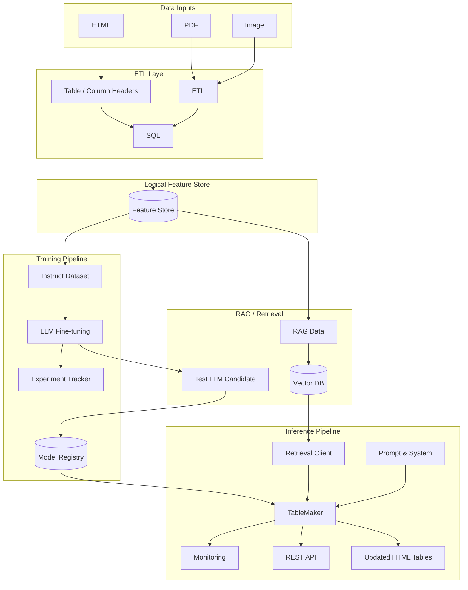
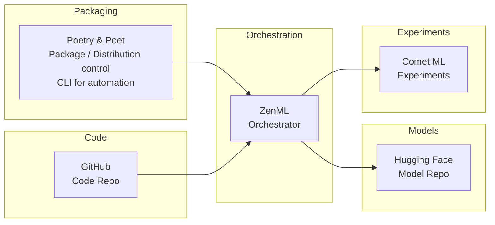

# TABLEMAKER
*Steve Keeling*

---

## Feature Pipeline

Data Collection Pipeline — *Data for fine-tuning and RAG*

```mermaid
flowchart TD
    subgraph Inputs["Data Inputs"]
        HTML[HTML]
        PDF[PDF]
        IMG[Image]
    end

    subgraph ETL["ETL Layer"]
        TableCol["Table / Column Headers"]
        SQL1[SQL]
        ETLProc[ETL]
    end

    subgraph Store["Logical Feature Store"]
        LFS[(Feature Store)]
    end

    subgraph Training["Training Pipeline"]
        ExpTracker[Experiment Tracker]
        InstructDS[Instruct Dataset]
        LLMFine[LLM Fine-tuning]
        ModelReg[(Model Registry)]
    end

    subgraph RAG["RAG / Retrieval"]
        VectorDB[(Vector DB)]
        RAGData[RAG Data]
        TestLLM[Test LLM Candidate]
    end

    subgraph Inference["Inference Pipeline"]
        TM[TableMaker]
        PromptSys[Prompt & System]
        Monitor[Monitoring]
        RetClient[Retrieval Client]
        RESTAPI[REST API]
        UpdatedHTML[Updated HTML Tables]
    end

    HTML --> TableCol
    PDF --> ETLProc
    IMG --> ETLProc
    TableCol --> SQL1
    ETLProc --> SQL1
    SQL1 --> LFS

    LFS --> InstructDS
    LFS --> RAGData
    InstructDS --> LLMFine
    LLMFine --> ExpTracker
    LLMFine --> TestLLM
    TestLLM --> ModelReg

    RAGData --> VectorDB
    VectorDB --> RetClient

    ModelReg --> TM
    RetClient --> TM
    PromptSys --> TM
    TM --> Monitor
    TM --> RESTAPI
    TM --> UpdatedHTML
```

---

## Tooling

```mermaid
graph LR
    subgraph Packaging
        Poetry["Poetry & Poet\nPackage / Distribution control\nCLI for automation"]
    end

    subgraph Orchestration
        ZenML["ZenML\nOrchestrator"]
    end

    subgraph Models
        HF["Hugging Face\nModel Repo"]
    end

    subgraph Code
        GitHub["GitHub\nCode Repo"]
    end

    subgraph Experiments
        CometML["Comet ML\nExperiments"]
    end

    Poetry --> ZenML
    ZenML --> HF
    ZenML --> CometML
    GitHub --> ZenML
```
